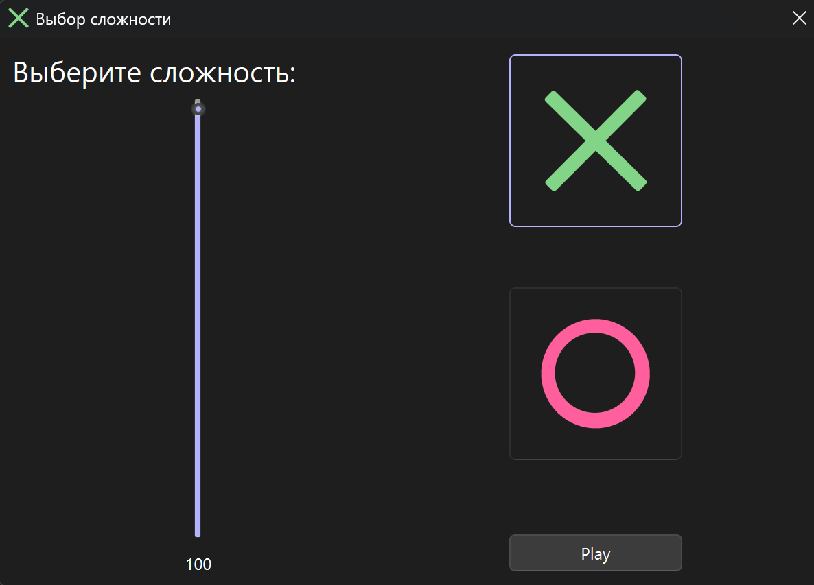
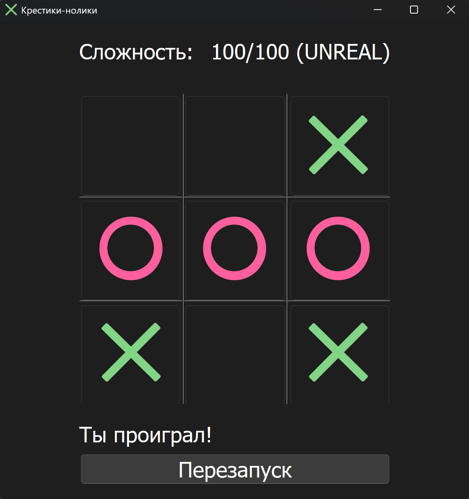
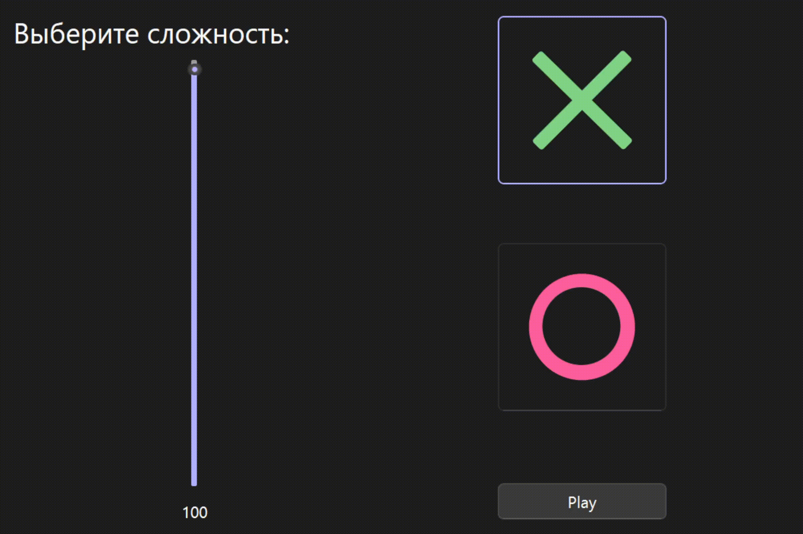

# Tic Tac Toe (Qt C++ with Move Evaluation Bot)

**Tic Tac Toe** is a desktop implementation of the classic 3x3 grid game, built using **Qt C++**. It features a bot opponent that evaluates **all possible future moves** (full game tree traversal) to determine its next action. The bot's behavior can be adjusted by setting a **difficulty level**, which defines the **probability** of it choosing the best possible move.

  
   
  
   
  

---

## 🎮 Features

- 🧩 **Classic 3×3 Tic Tac Toe**
- 🤖 Bot calculates **all possible move sequences** (no AI)
- 🎯 **Difficulty levels** adjust the bot's behavior
- 🖥️ Intuitive Qt-based GUI
- 🔁 Restart support

---

## 🛠️ Technologies Used

- **C++17**
- **Qt Framework** (Widgets and UI forms)

---
